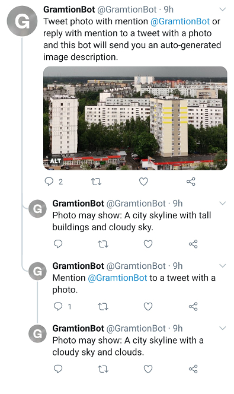
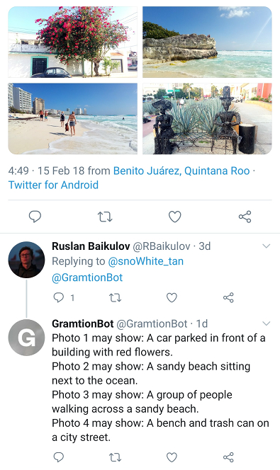

<p align="center">
  <a href="https://github.com/lRomul/gramtion"></a>
</p>
<p align="center">
    <em>Twitter bot for generating photo descriptions</em>
</p>

---

**Twitter**: <a href="https://twitter.com/GramtionBot" target="_blank">https://twitter.com/GramtionBot</a>

**Source Code**: <a href="https://github.com/lRomul/gramtion" target="_blank">https://github.com/lRomul/gramtion</a>

---

This repo contains the source code of the Twitter [@GramtionBot](https://twitter.com/GramtionBot) for generating photo descriptions.  
Use cases and intends: 
* Help visually impaired Twitter users. 
Good image descriptions (alt text) will help them understand what is happening in an image. 
Instagram and Facebook use deep learning for image captioning. 
Twitter users can only add custom alt text descriptions themselves. 
Automation of alt text generation will help Twitter be more accessible. 
* Collect dataset for image captioning (legal issues for this use case are yet to be discussed). 
Annotations can be done by creating polls about prediction quality and getting corrected descriptions from users. 
Twitter API v1.1 has not the ability to create polls, but it will be added in API v2. 

## How to use

Tweet photo with mention [@GramtionBot](https://twitter.com/GramtionBot) or reply with mention to a tweet with a photo and the bot will send you an auto-generated image description.

 

Links to [example 1](https://twitter.com/GramtionBot/status/1320423819794960384) and [example 2](https://twitter.com/snoWhite_tan/status/963953292383580165) tweets.

## Dependencies

Gramtion is mainly built from ready-to-use third party libraries:
* Image captioning model taken from [self-critical.pytorch](https://github.com/ruotianluo/self-critical.pytorch).
* Evaluate text and image similarity with [CLIP](https://openai.com/blog/clip/) by OpenAI.
* OCR and image labels by [Google Vision Ai](https://cloud.google.com/vision).
* Bot written with [Tweepy](https://github.com/tweepy/tweepy).
* Configuration settings implemented with [pydantic](https://github.com/samuelcolvin/pydantic/).
* Docker image based on [Dokai](https://github.com/osai-ai/dokai).

## Current issues 

* Some descriptions may be confusing. Annotations may be created by using polls about prediction quality and getting corrected descriptions from users. Twitter API v1.1 has not the ability to create polls, but it will be added in API v2 endpoint `POST /2/tweets`.
* For drawings and some other types of images, the predictions are pretty random. 
* Some results may reflect inherent gender and racial biases of open datasets.

## Run own bot

To run an instance of the bot you need to install [Docker](https://www.docker.com/) and create [Twitter API auth credentials](https://realpython.com/twitter-bot-python-tweepy/#creating-twitter-api-authentication-credentials).  
If you have a Twitter developer account, but don't want to use it as a bot account, you can authenticate a new user that’s not has a developer account with [twurl](https://github.com/twitter/twurl).

* Create `.env` file with credentials. 

    ```
    CONSUMER_KEY={{ consumer_key }}
    CONSUMER_SECRET={{ consumer_secret }}
    ACCESS_TOKEN={{ access_token }}
    ACCESS_TOKEN_SECRET={{ access_token_secret }}
    ```

* Setup Google Vision AI and create account key ([link](https://cloud.google.com/vision/docs/setup)). Copy key as `google_key.json `.

* Run Docker container with running the bot  

    ```bash
    docker run -d --restart=always \
        --env-file .env \
        -v google_key.json:/workdir/google_key.json \
        --name=gramtion \
        ghcr.io/lromul/gramtion:0.0.5
    ```

* Open logs 

    ```bash
    docker logs -f gramtion
    ```

* Stop container

    ```bash
    docker stop gramtion
    docker rm gramtion
    ```
